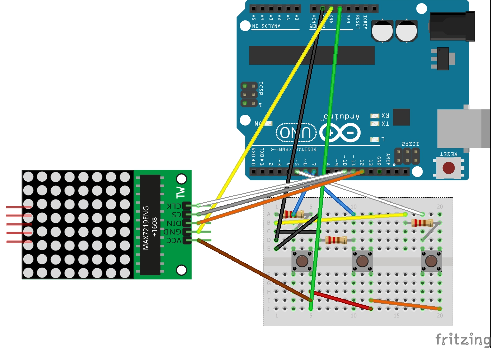

# __Clignotant vélo__

LED connectée à l'arduino pour la signalisation d'un vélo

__Projet en binome :
@LuisRibeiro1195
@OSylla92__

## __Composants__

+ Arduino
+ Matrice LED
+ Bread bord
+ Press button

## __Bibliothéque utilisée__

+ LedControl

## __Schéma__ 

